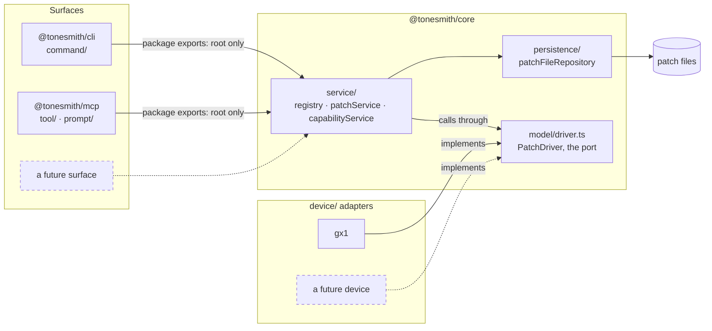
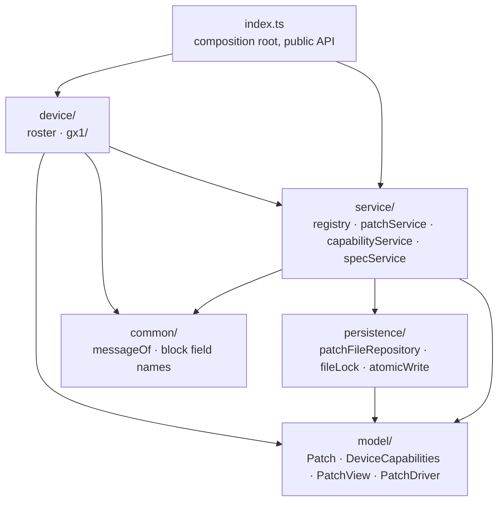
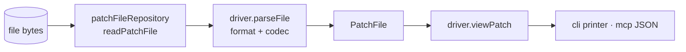
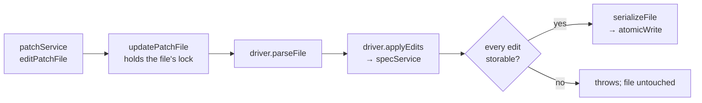
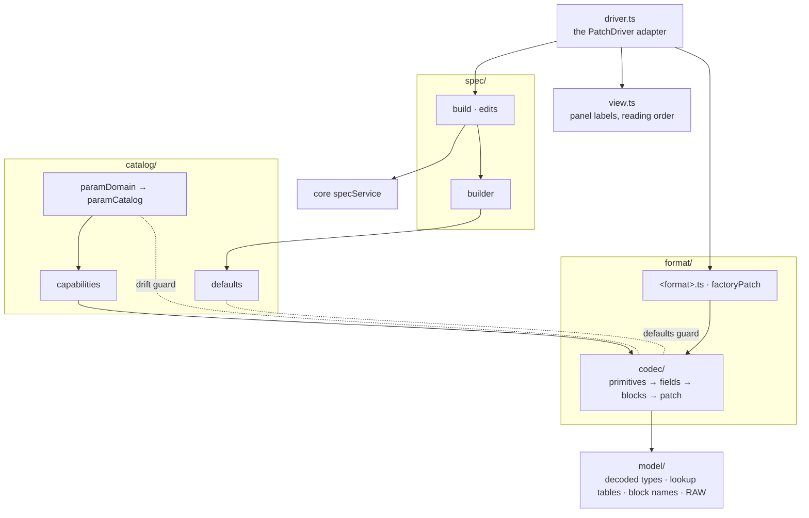
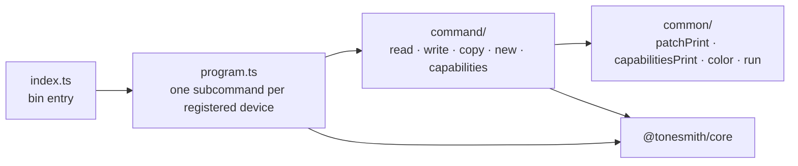
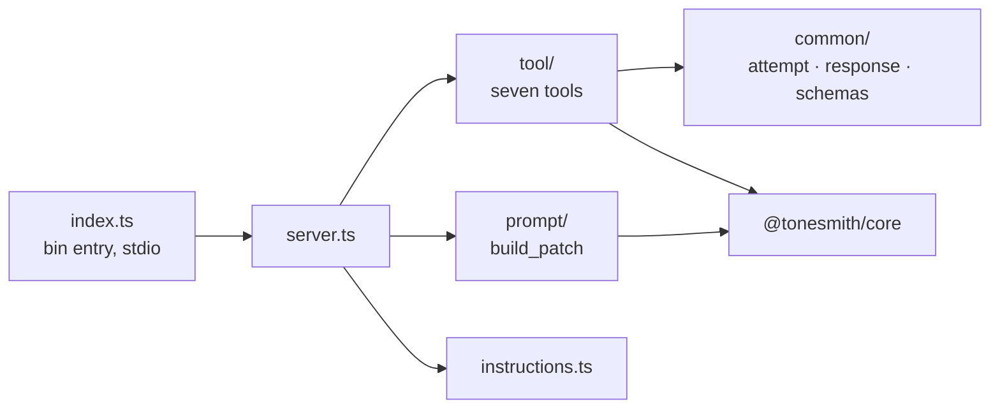
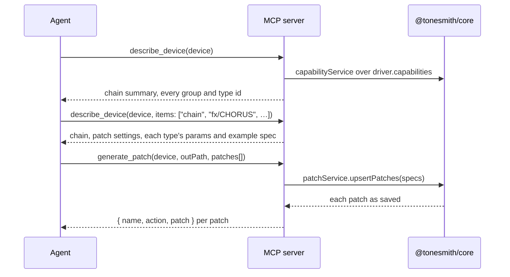

# Architecture

How tonesmith is put together: the layers, the patterns they follow, and a diagram for how the
packages fit and for each package inside. The arrows in these diagrams are import directions, and
lint enforces them, so a change that breaks one fails `pnpm lint` before it reaches review. A change
that adds, removes or moves a box updates its diagram in the same pull request.

## Layers

Every folder under `src/` is a layer named for its role, and a layer imports only the layers below
it in this table.

| Layer              | Where                                                                                     | Pattern             |
|--------------------|-------------------------------------------------------------------------------------------|---------------------|
| Surface            | cli `command/`; mcp `tool/` and `prompt/`                                                 | Driving adapters    |
| Service            | core `service/`: `patchService`, `capabilityService`, `specService`, `registry`           | Use cases, Registry |
| Data               | core `persistence/`: `patchFileRepository`, `fileLock`, `atomicWrite`                     | Repository          |
| Models             | core `model/`: patch, capabilities, the view a person reads, and `PatchDriver`            | Port                |
| Plugins            | core `device/<id>/`, one per supported device, listed in `device/index.ts`                | Driven adapters     |

Files are camelCase and named for their domain, and folders under `src/` are singular. Each package
also has a `common/` of pieces its layers share, which imports none of them.

## Patterns

- **Ports and adapters.** `PatchDriver` (`core/src/model/driver.ts`) is the port: everything core
  needs from a device. Each `device/<id>/` is an adapter implementing it, and the CLI and the MCP
  server are adapters on the other side, driving core. Neither side knows the other exists.
- **Registry.** `service/registry.ts` holds the drivers and hands one out by id, so a surface never
  imports a device.
- **Composition root.** `core/src/index.ts` is the one place the roster is registered and the public
  surface is assembled.
- **Repository.** `persistence/patchFileRepository.ts` is the only code that reads or writes a patch
  file, and every write it makes happens under that file's lock.
- **Data mapper.** A device's `format/` turns file bytes into its decoded model and back, starting
  every write from the original bytes so the fields it doesn't know pass through untouched.
- **Builder.** A device's `spec/builder.ts` fills every control a spec leaves out with its factory
  value.
- **Presenter.** `PatchDriver.viewPatch` composes a patch as a person reads it; the CLI's printers
  and the MCP server's JSON responses only render it.

## How the packages fit



What holds each boundary:

- **Surfaces reach core only through its root export.** Core's `package.json` exports nothing else, so
  a deep import fails to resolve.
- **Shared core never imports a device.** The service layer's lint block forbids `device/`, so a
  second device plugs in without a shared file changing to make room for it.
- **Only persistence touches the disk.** Drivers are linted against every fs module and against
  `persistence/`, and the model and common layers against everything above them.
- **No import cycles.** `import-x/no-cycle` rejects a runtime cycle anywhere, and a file may not
  import its own folder's barrel, which also keeps type-only cycles out.

## core



`specService` is what makes a device cheap to add. It checks a patch spec against the device's
catalog, resolves dot-path edits, coerces their values and re-seeds a block whose type an edit
switches, reading nothing but the `DeviceCapabilities` a driver already publishes. A driver adds only
the checks no catalog can express, such as which characters its display can show.

## Data flow

Reading a file, for `read` and `read_patch`:



Editing a patch, for `write` and `write_fields`. The lock spans the whole read-change-write, so two
edits to one file take turns instead of one losing the other's change:



Building patches, for `generate_patch`. Every spec is built before the file is read, so one bad
spec leaves the file as it was:


## A device driver

Every `device/<id>/` has this shape; gx1 is the working example. The layers inside it follow the same
rule as core's: `spec/` builds on `catalog/`, which builds on `format/`, which builds on `model/`.



The catalog, the capabilities and the decoded types are three views of one truth: the param catalog
is the ground truth for each control, capabilities is the structure a consumer browses, and the
types are the decoded shape. The dotted edges are the tests that keep them equal: the drift guard
holds every codec field list against the catalog, and the defaults guard decodes a factory-default
export through the codec and holds the builder's factory values against what it reads.

## cli



A device ships no CLI code. `program.ts` gives every registered driver the same commands, and the
printers walk the `PatchView` and `DeviceCapabilities` the driver provides.

## mcp



No tool's schema carries a device's catalog: `generate_patch` takes a permissive `patches` array and
lets the driver validate it, so the schema every request pays for stays the same size whatever the
roster holds. An agent learns a device from `describe_device` instead, once, as below.

## How an agent builds a patch



Two lookups and one build, however many patches: the second lookup names every type the patches
will use, and the build's response echoes each patch with its defaults filled in, so no follow-up
read is needed.

## Repository layout

```text
fixtures/<id>/                one committed real patch-file export per device: the round-trip
                              baseline shared by the core, cli and mcp tests

core/                         @tonesmith/core
  src/
    index.ts                  composition root: registers the roster, assembles the public API
    model/                    types every layer speaks
      patch.ts                Patch, PatchBlock, PatchFile, FieldValue
      driver.ts               PatchDriver<T>, the port every device implements
      capabilities.ts         DeviceCapabilities, ChainSpec and ChainBlock, groups, types, ParamSpec
      view.ts                 PatchView / BlockView / PatchDetail: a patch as a person reads it
    common/                   error.ts (messageOf), blockField.ts (the keys every block carries)
    persistence/
      patchFileRepository.ts  every read and write of a patch file; writes happen under the lock
      fileLock.ts             withFileLock: one queue per file, so read-change-writes take turns
      atomicWrite.ts          sibling file then rename, so a failed write never truncates a library
    service/
      registry.ts             registerDriver / getDriver (throws on an unknown id) / listDrivers
      patchService.ts         resolvePatch(es), readPatchFile, editPatchFile, upsertPatches,
                              copyPatch, createPatchFile
      capabilityService.ts    findGroup / findType, and lookup: the chain, a group, or a type
      specService.ts          catalog checks for specs and edits, the dot-path engine, re-seeding
    device/
      index.ts                the roster, one line per device
      <id>/                   one driver, always this shape:
        index.ts              the device's whole published surface: driver, patch and block types, RAW
        driver.ts             the PatchDriver object, wiring the layers below together
        view.ts               the device's blocks in reading order, under its panel labels
        spec/                 build.ts (device checks, then build), edits.ts (into specService),
                              builder.ts (factory defaults for what a spec leaves out)
        catalog/              paramDomain.ts, paramCatalog.ts (the param ground truth),
                              capabilities.ts, defaults.ts (factory values per type)
        format/               <format>.ts (bytes in and out, named after the format; gx1: tsl.ts),
                              factoryPatch.ts, codec/ (primitives, fields, per-block, patch)
        model/                decoded types, lookup tables and reverse indexes, block names and
                              labels, RAW (the symbol original bytes travel under)
  tests/                      mirrors src/, plus device/conformance.test.ts over the whole roster
    helpers.ts                fixture paths, `present`, `storedAs`, scratchDir / scratchFile
    fixtures/<id>/            supplementary fixtures (gx1: default-init.tsl, the factory default)
  docs/<id>/                  captured manuals as Markdown, and FORMAT.md, the byte-level format spec

cli/                          @tonesmith/cli (bin: tonesmith)
  src/
    index.ts                  bin entry: buildProgram().parse()
    program.ts                one subcommand per registered driver
    command/                  one file per command, and configureDeviceCommands in index.ts
    common/                   patchPrint, capabilitiesPrint, color (the terminal gate), run
  tests/                      in-process commander, one suite per command

mcp/                          @tonesmith/mcp (bin: tonesmith-mcp)
  src/
    index.ts                  bin entry: buildServer() over stdio
    server.ts                 registers the tools and the prompt
    instructions.ts           onboarding text sent at initialize: the two-lookups-one-build path
    tool/                     list_devices, read_patch, write_fields, describe_device, copy_patch,
                              create_patch_file, generate_patch
    prompt/                   build_patch, with device completion
    common/                   attempt (a throw becomes an error response), response, schemas
  tests/                      MCP InMemoryTransport, one suite per tool

tools/                        repo tooling, not published
  doc-to-md/                  an HTML page or PDF, URL or local file, to Markdown
```
